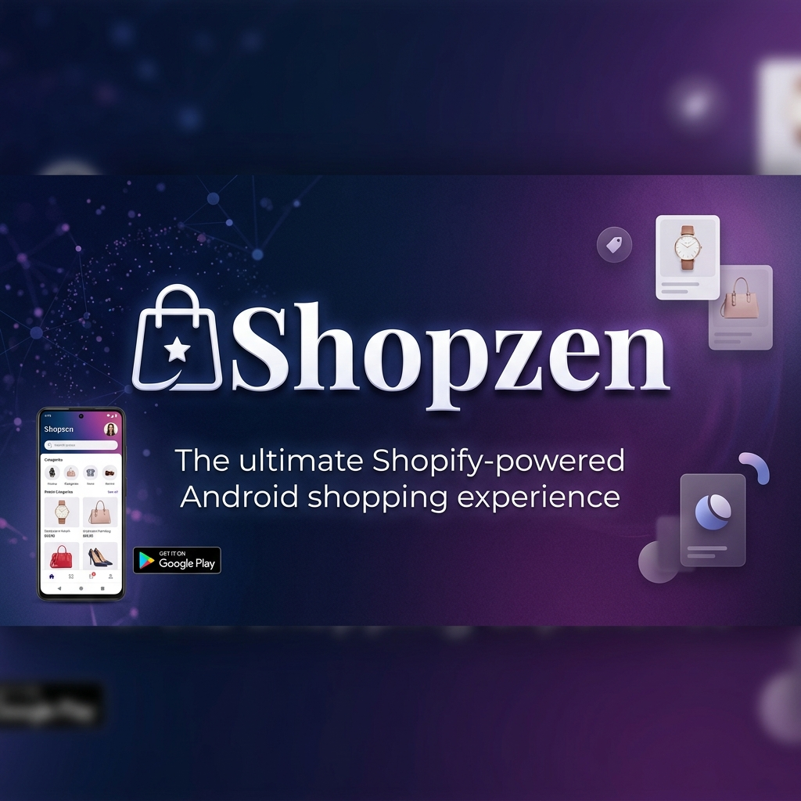
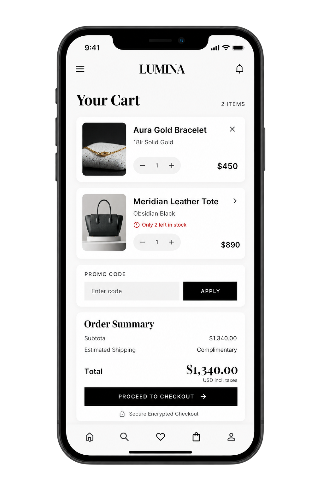
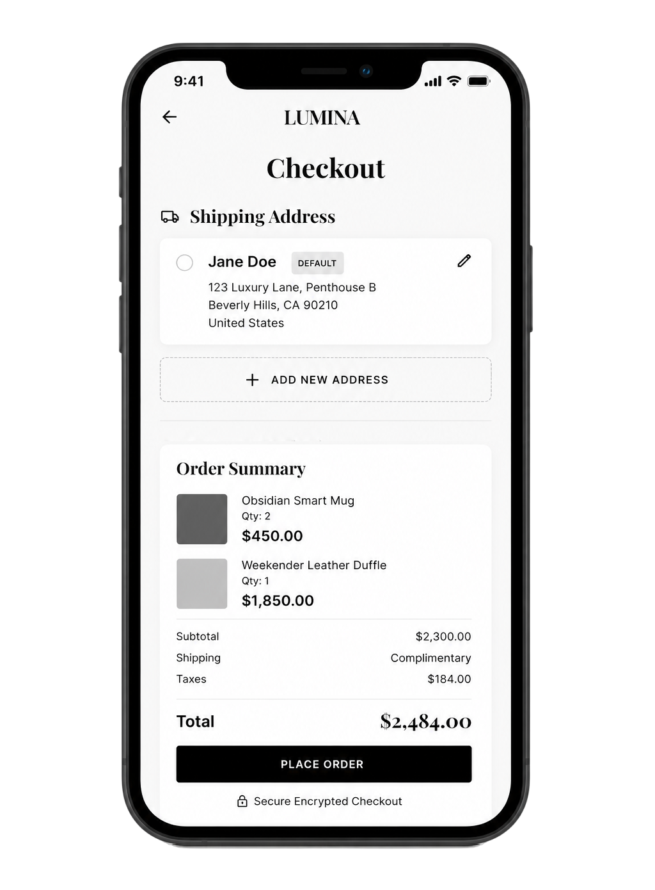
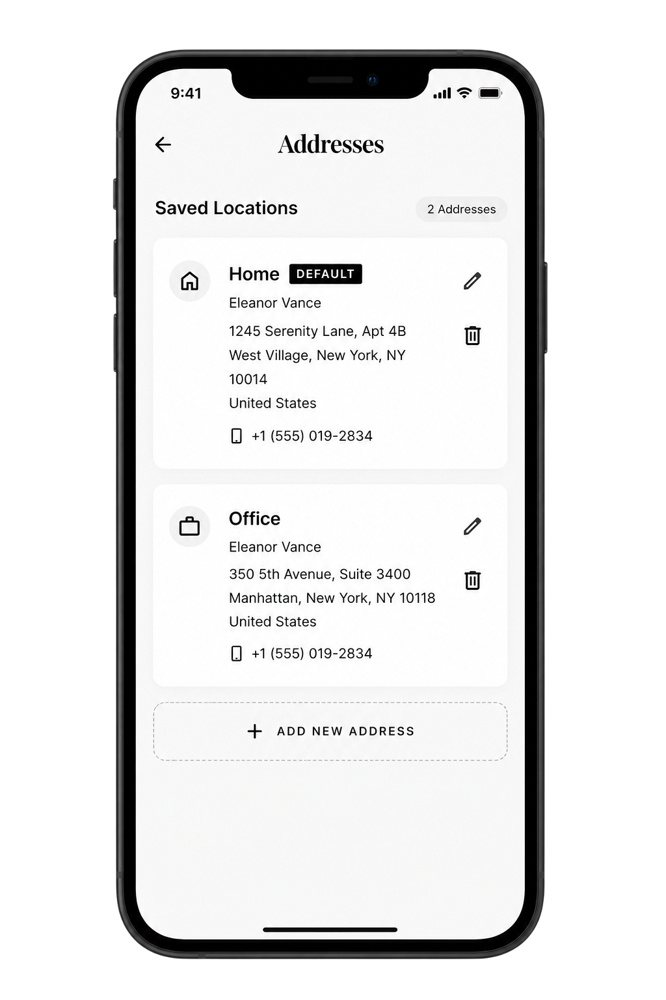
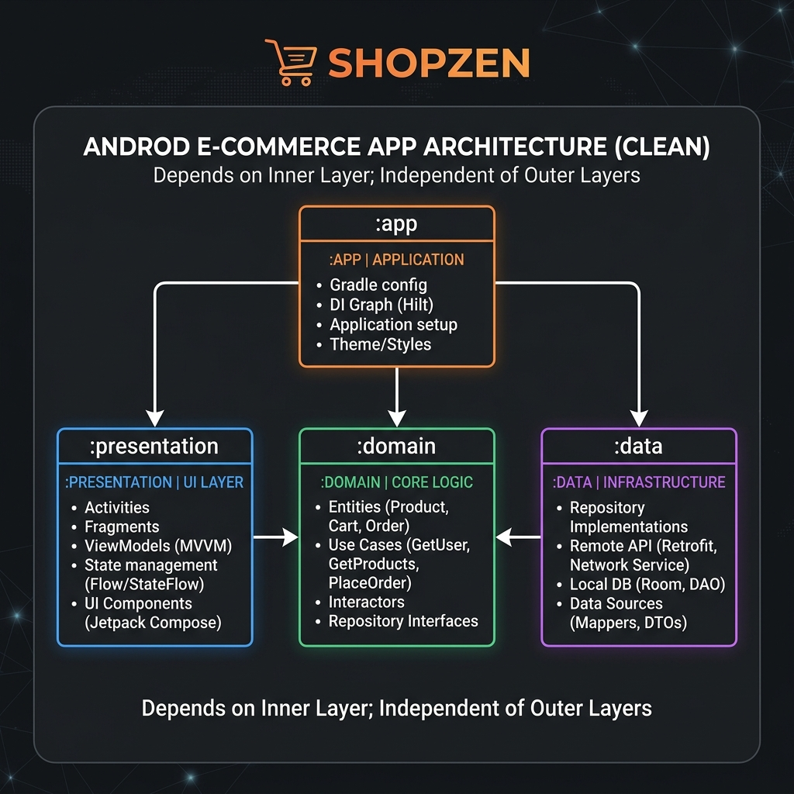
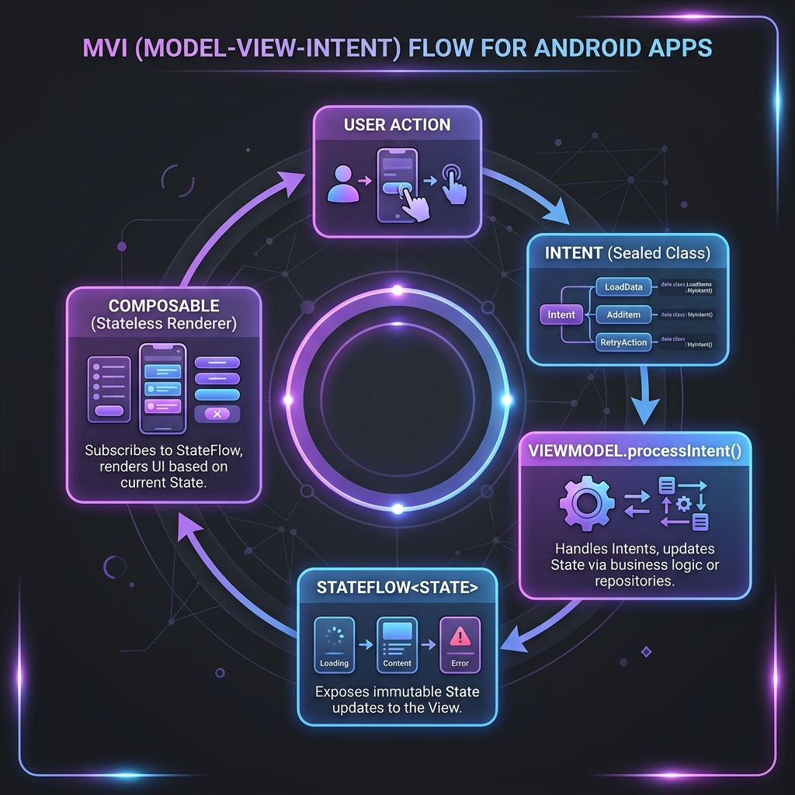
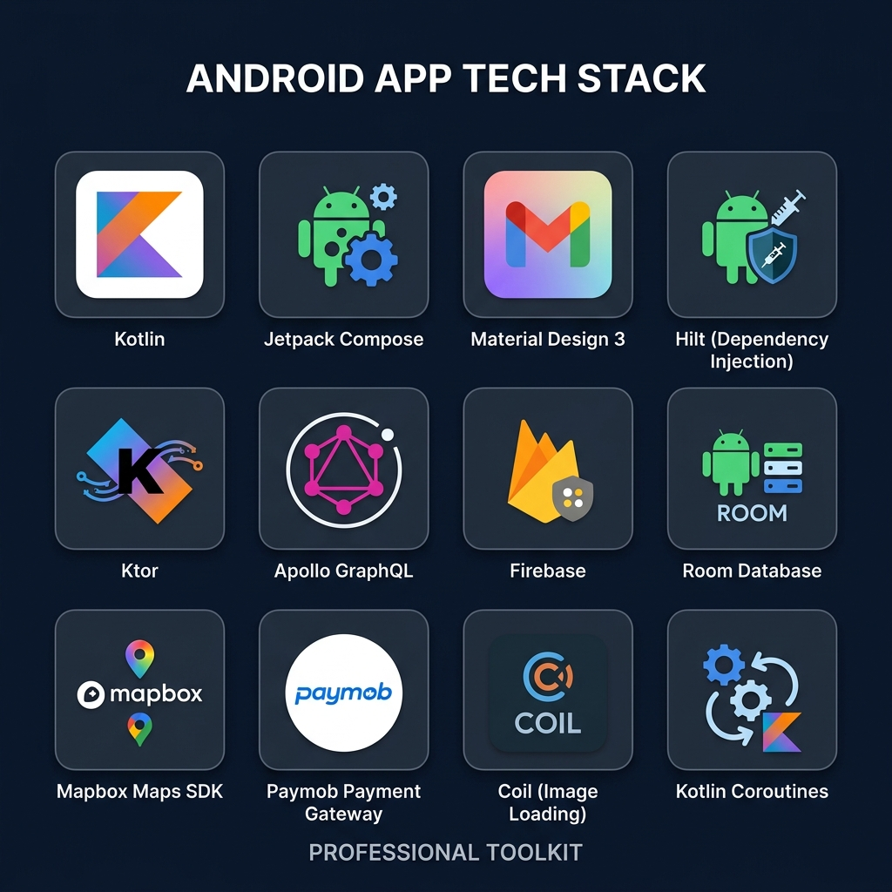

<div align="center">



<br/><br/>

[](https://kotlinlang.org)
[](https://developer.android.com/compose)
[](https://developer.android.com)
[](https://dagger.dev/hilt/)
[](https://shopify.dev/docs/api/admin-rest)
[](LICENSE)

<br/>

**A premium Android e-commerce client powered by the Shopify Admin API.**  
Browse curated collections, save favourites, checkout with card or cash — backed by Clean Architecture and a fully offline-capable experience.

<br/>

[✨ Features](#-features) &nbsp;·&nbsp; [🏗️ Architecture](#%EF%B8%8F-architecture) &nbsp;·&nbsp; [🛠️ Tech Stack](#%EF%B8%8F-tech-stack) &nbsp;·&nbsp; [📱 Screenshots](#-screenshots) &nbsp;·&nbsp; [🚀 Getting Started](#-getting-started)

</div>

---

## 📋 Table of Contents

1. [Overview](#-overview)
2. [Features](#-features)
3. [Screenshots](#-screenshots)
4. [Architecture](#%EF%B8%8F-architecture)
5. [MVI Pattern](#-mvi-pattern)
6. [Tech Stack](#%EF%B8%8F-tech-stack)
7. [Project Structure](#-project-structure)
8. [Getting Started](#-getting-started)
9. [API & Secrets Configuration](#-api--secrets-configuration)
10. [Navigation Map](#-navigation-map)
11. [Business Rules](#-business-rules)
12. [Testing](#-testing)
13. [Team](#-team)

---

## 🌟 Overview

**Shopzen** is a feature-complete, production-grade Android shopping application built on top of the **Shopify Admin API** (REST + GraphQL). It supports full guest browsing and authenticated flows including wishlist, cart, checkout, order history, address management, and an AI-powered product assistant.

The project follows **Clean Architecture** principles organized into four Gradle modules with the **MVI** pattern, ensuring strict separation of concerns, testability, and long-term scalability.

---

## ✨ Features

### 🛍️ Catalog & Browsing
- **Home Screen** — Featured hero banner, curations grid, category chips, and best-sellers feed
- **Brand List** — Browse all products filtered by vendor/brand
- **Category Products** — Products filtered by Shopify collection
- **Product Detail** — Full image gallery (`HorizontalPager`), size/variant selector, real-time stock indicator, and reviews
- **Offline Caching** — Products cached in Room for uninterrupted browsing

### 🔍 Search & Discovery
- **Global Search** — Debounced (300 ms) full-text search against the Shopify REST API
- **Advanced Filters** — Filter by category, sub-category, and brand with dismissable chip UI
- **Sorting** — Price (low→high / high→low), best seller, and sub-category

### ❤️ Wishlist
- **Save Favourites** — Persist wishlist items per user in Room
- **Live Heart Icon** — Reactive `Flow<Boolean>` drives the toggle state on `ProductCard` and `ProductDetailScreen`
- **Multi-user Support** — Each account sees only its own wishlist items

### 🛒 Cart
- **Full Cart Management** — Add, update quantity, and remove items
- **Stock Enforcement** — Quantity capped at Shopify's real-time `inventoryQuantity`
- **Promo / Discount Codes** — Validate coupons via Shopify REST; inline error shown on invalid codes
- **Live Totals** — Recalculated locally on every mutation — no extra network call

### 💳 Checkout
- **Order Summary** — Full item list, shipping address picker, and discount breakdown
- **Payment Methods** — Cash on Delivery (COD) or Online Payment via **Paymob**
- **COD Limit Guard** — COD option hidden automatically when `totalPrice > MAX_COD_AMOUNT`
- **Paymob Integration** — Creates a Paymob payment intention, launches the SDK, then places the Shopify order only on confirmed payment
- **Order Confirmation** — Shopify sends a receipt email automatically (`send_receipt: true`)

### 👤 Account & Profile
- **Profile Screen** — Personalized greeting, recent order count, wishlist preview (max 4 items)
- **Order History & Detail** — Full order list with payment method and discount breakdown
- **Address Management** — CRUD addresses with Mapbox geocoding & autocomplete validation
- **Currency Selector** — Live exchange rates applied globally; selection persisted in DataStore
- **Settings** — Available to guests; preferences stored locally when unauthenticated

### 🔐 Authentication
- **Email / Password** — Firebase Auth sign-in and registration
- **Google Sign-In** — One-tap OAuth via Firebase
- **Email Verification** — Sent automatically on successful registration
- **Forgot Password** — Dedicated reset flow
- **Auth Gating** — Cart and Wishlist redirect unauthenticated users to Login with `returnRoute`
- **Logout** — Always requires `ConfirmationDialog`; clears local session data

### 🤖 AI Features
- **AI Chat** — Conversational shopping assistant
- **AI Product Comparison** — Side-by-side AI-driven comparison of selected products

### 📦 Onboarding
- **One-time Onboarding Flow** — Shown only on first launch; completion state persisted in DataStore

---

## 📱 Screenshots


<br/>

<table>
  <tr>
    <td align="center">
      <br/>
      <b>🏠 Home</b><br/>
      <sub>Hero banner, curations, best sellers</sub>
    </td>
    <td align="center">
      <br/>
      <b>🔍 Search</b><br/>
      <sub>Debounced search with collection filters</sub>
    </td>
    <td align="center">
      <br/>
      <b>❤️ Wishlist</b><br/>
      <sub>Saved favourites per user, Room-backed</sub>
    </td>
  </tr>
  <tr>
    <td align="center">
      <br/>
      <b>🛒 Cart</b><br/>
      <sub>Stock-enforced quantities, promo codes</sub>
    </td>
    <td align="center">
      <br/>
      <b>💳 Checkout</b><br/>
      <sub>Address selection, order summary, payment</sub>
    </td>
    <td align="center">
      <br/>
      <b>📍 Addresses</b><br/>
      <sub>Mapbox-validated address management</sub>
    </td>
  </tr>
</table>

---

## 🏗️ Architecture

Shopzen follows **Clean Architecture** with strict, unidirectional dependencies across four Gradle modules:



```
:presentation ──▶ :domain ◀── :data
                    ▲
              :app wires everything
```

| Module | Role | Must NOT contain |
|---|---|---|
| `:domain` | Pure Kotlin models, repository interfaces, use cases | `android.*`, Ktor, Room, Firebase |
| `:data` | DTOs, Entities, `RepositoryImpl`, API services, DAOs, mappers | Domain models used without mapping |
| `:presentation` | Composables, ViewModels, MVI State + Intent | Direct repository calls, business logic |
| `:app` | `ShopzenApplication`, `MainActivity`, DI modules, `AppNavGraph` | Business logic, use cases, data sources, UI |

### Mandatory Enforcement

- `:domain` — **zero** imports from `android.*`, `retrofit2.*`, `androidx.room.*`
- `:data` — DTOs and Room entities **never** leave the module without being mapped first
- `:presentation` — ViewModels call **only** UseCases, never repositories directly
- `:app` — no business logic; wires and launches only
- Composable functions contain **zero** business logic

---

## 🔄 MVI Pattern

Every feature screen follows a strict, consistent **MVI (Model-View-Intent)** cycle:



```
User Action
    │
    ▼
Intent (sealed class)
    │
    ▼
ViewModel.processIntent()
    │  (calls UseCase, updates state)
    ▼
StateFlow<FeatureState> (data class)
    │
    ▼
Composable (stateless renderer)
```

### Contracts

| Contract | Implementation |
|---|---|
| **Intent** | `sealed class` — every user or system event is an explicit branch |
| **State** | `data class` with default values; updated via `copy()` |
| **ViewModel** | Single `MutableStateFlow<FeatureState>`; all coroutines in `viewModelScope` |
| **Composable** | Receives `state` and `onIntent: (Intent) -> Unit`; zero business logic |

Every feature state always includes: `isLoading: Boolean`, `error: String?`, and `show*Dialog: Boolean` flags for each destructive action.

---

## 🛠️ Tech Stack



| Concern | Technology | Version |
|---|---|---|
| **Platform** | Android | minSdk 26, targetSdk 35 |
| **Language** | Kotlin | 2.0.21 |
| **UI** | Jetpack Compose | BOM 2024.09.00 |
| **Design System** | Material 3 | — |
| **Architecture** | Clean Architecture + Multi-Module + MVI | — |
| **DI** | Hilt | 2.59.2 |
| **REST Networking** | Ktor Client | 3.1.3 |
| **GraphQL** | Apollo Android | 5.0.0 |
| **Auth** | Firebase Auth (Email/Password + Google) | BOM 34.15.0 |
| **Local DB** | Room | 2.6.1 |
| **Async** | Kotlin Coroutines + Flow + StateFlow | 1.11.0 |
| **Navigation** | Jetpack Compose Navigation | 2.8.5 |
| **Maps & Geocoding** | Mapbox Maps + Search SDK | 11.18.1 / 2.6.0 |
| **Payment** | Paymob Mobile SDK | 1.9.2 |
| **Image Loading** | Coil | 2.7.0 |
| **Serialization** | kotlinx.serialization | 1.7.3 |
| **Preferences** | Jetpack DataStore | 1.1.1 |
| **Testing** | JUnit 4, MockK, Coroutines Test | — |

---

## 📁 Project Structure

```
Shopzen/
├── app/                              # :app — wires everything
│   └── src/main/kotlin/shopzen/app/
│       ├── ShopzenApplication.kt     # @HiltAndroidApp
│       ├── MainActivity.kt           # Single Activity, hosts NavHost
│       ├── di/
│       │   ├── network/              # NetworkModule (Ktor, Apollo)
│       │   ├── firebase/             # FirebaseModule
│       │   ├── DatabaseModule.kt
│       │   └── RepositoryModule.kt
│       └── navigation/
│           ├── AppNavGraph.kt        # Single NavHost, all destinations flat
│           └── NavScreen.kt          # All route sealed objects/classes
│
├── domain/                           # :domain — pure Kotlin, no Android
│   └── src/main/kotlin/shopzen/domain/
│       ├── auth/       ├── cart/     ├── wishlist/
│       ├── catalog/    ├── checkout/ ├── product/
│       ├── profile/    ├── search/   ├── ai/
│       └── onboarding/
│
├── data/                             # :data — infrastructure layer
│   └── src/main/kotlin/shopzen/data/
│       ├── auth/       ├── cart/     ├── wishlist/
│       ├── catalog/    ├── checkout/ ├── product/
│       ├── profile/    ├── search/   ├── customer/
│       ├── remote/                   # Shared Ktor/Apollo configuration
│       └── database/
│           └── ShopzenDatabase.kt
│
├── presentation/                     # :presentation — UI layer
│   └── src/main/kotlin/shopzen/presentation/
│       ├── common/
│       │   ├── theme/                # ShopzenTheme, Color, Typography
│       │   └── components/           # Shared Composables
│       ├── auth/       ├── cart/     ├── wishlist/
│       ├── catalog/    ├── checkout/ ├── brand/
│       ├── profile/    ├── search/   ├── ai/
│       ├── category/   ├── product/
│       └── onboarding/
│
├── doc/
│   └── images/                       # All project documentation images
├── gradle/
│   └── libs.versions.toml            # Centralized version catalog
└── settings.gradle.kts
```

Each feature package under `:presentation` follows a strict layout:
```
{feature}/
├── screen/       ← Stateless Composable entry points
├── components/   ← Feature-scoped reusable UI pieces
├── viewmodel/    ← @HiltViewModel
├── state/        ← data class with safe default values
└── intent/       ← sealed class of all user/system events
```

---

## 🚀 Getting Started

### Prerequisites

| Tool | Version |
|---|---|
| Android Studio | Ladybug (2024.2.1) or newer |
| JDK | 17+ |
| Android SDK | API 26+ |
| Shopify Partner account | Admin API access token |
| Firebase project | Email/Password + Google Sign-In enabled |
| Mapbox account | Download token |
| Paymob account | API key + Integration ID |

### 1. Clone the Repository

```bash
git clone https://github.com/your-org/Shopzen.git
cd Shopzen
```

### 2. Configure `local.properties`

Create `local.properties` in the root directory (this file is already git-ignored):

```properties
# Android SDK path (auto-set by Android Studio)
sdk.dir=/path/to/your/android/sdk

# Shopify
SHOPIFY_BASE_URL=https://your-store.myshopify.com
SHOPIFY_ACCESS_TOKEN=shpat_xxxxxxxxxxxxxxxxxxxx
SHOPIFY_API_VERSION=2024-04

# Mapbox
MAPBOX_DOWNLOAD_TOKEN=sk.eyJ1Ijoi...

# Paymob
PAYMOB_API_KEY=your_paymob_api_key
PAYMOB_INTEGRATION_ID=your_integration_id
PAYMOB_IFRAME_ID=your_iframe_id

# Exchange Rates
EXCHANGE_RATE_API_KEY=your_key_here

# Business Rules
MAX_COD_AMOUNT=5000
```

### 3. Add Firebase Configuration

Download `google-services.json` from your Firebase console and place it at:

```
app/google-services.json
```

### 4. Build & Run

```bash
# Sync Gradle
./gradlew --refresh-dependencies

# Install on connected device or emulator
./gradlew :app:installDebug
```

Or open the project in Android Studio and press **▶ Run**.

---

## 🔌 API & Secrets Configuration

### Shopify API

Both the Shopify REST Admin API and GraphQL Admin API are used:

| Transport | Base URL |
|---|---|
| REST | `https://{hostname}/admin/api/{version}/{resource}.json` |
| GraphQL | `https://{hostname}/admin/api/{version}/graphql.json` |

All REST calls go through Ktor with the `X-Shopify-Access-Token` header.  
GraphQL operations live as `.graphql` files in `data/{feature}/remote/api/` and are consumed via Apollo Android's generated type-safe clients.

### Error Handling Pattern

All network calls are wrapped in `NetworkResult<T>` (`Success`, `Error`, `Loading`) using the `safeApiCall {}` extension inside `RemoteDataSource`. It catches `IOException` and converts all exceptions to `NetworkResult.Error`.

### Room Database

| Entity | Table | Feature |
|---|---|---|
| `CartItemEntity` | `cart_items` | cart |
| `WishlistEntity` | `wishlist_items` | wishlist |
| `ProductEntity` | `products` | catalog offline cache |
| `AddressEntity` | `addresses` | account |

All entities include a `userId` field for multi-user support. DAOs are only accessed via their `Local*DataSource` — never injected directly into repositories.

---

## 🗺️ Navigation Map

Single-Activity architecture with one flat `NavHost` in `AppNavGraph.kt`. All routes are constants in `NavScreen.kt`:

```
splash
  ├── [authenticated] ──▶ home
  └── [guest]         ──▶ onboarding ──▶ login
                                          ├── register ──▶ verify-email
                                          └── [success] ──▶ home

home
  ├── brand-list ──▶ brand-products ──▶ product-detail
  ├── category-products ──▶ product-detail
  └── product-detail

search ──▶ product-detail

wishlist        [auth required] ──▶ product-detail
cart            [auth required] ──▶ checkout-summary
                                      └── checkout-payment ──▶ order-confirmation

profile         [auth required]
  ├── personal-details
  ├── main/profile/orders ──▶ main/profile/orders/{orderId}
  └── addresses ──▶ address-edit

ai-chat
ai-comparison
main/settings   [guest accessible]
```

---

## 📏 Business Rules

| Rule | Detail |
|---|---|
| **Guest Access** | Browse products and categories freely without signing in |
| **Auth Gate** | Cart and Wishlist require authentication; guests are redirected to Login with `returnRoute` |
| **Stock Enforcement** | Cart quantity cannot exceed real-time Shopify `inventoryQuantity` |
| **COD Limit** | Cash on Delivery blocked when `totalPrice > Constants.MAX_COD_AMOUNT` |
| **Destructive Actions** | All delete / logout / order-submit actions require a `ConfirmationDialog` |
| **Coupon Errors** | Invalid coupon shows an **inline** field error — not a dialog |
| **Address Validation** | Validated via Mapbox geocoding or autocomplete |
| **Verification Email** | Sent automatically on successful registration |
| **Order Email** | Shopify sends a confirmation email automatically (`send_receipt: true`) |
| **Currency** | Selected currency persisted in DataStore; applied globally to all price displays |
| **Multi-user Devices** | All Room entities scoped by `userId` — each account sees only its own data |

---

## 🧪 Testing

```bash
# Run all unit tests
./gradlew test

# Run instrumented tests on a connected device
./gradlew connectedAndroidTest
```

| Concern | Tool |
|---|---|
| Unit Tests | JUnit 4 + MockK |
| Coroutine Testing | `kotlinx-coroutines-test` |
| StateFlow / ViewModel | Turbine |
| Hilt DI in Tests | `hilt-android-testing` |
| UI Tests | Compose UI Test + Espresso |

---

## 👥 Team

| Member | GitHub                                    |
|---|-------------------------------------------|
| **Yousef** | [@yousef](https://github.com/yusefellban) |
| **Rashed** | [@rashed](https://github.com/abdelrahman-rashed-ali)      |
| **Nour** | [@nour](https://github.com/Noureldeen75)          |
| **Ziad** | [@ziad](https://github.com/ZeiadT)          |

---

## 📄 License

```
MIT License — Copyright (c) 2026 Shopzen Team

Permission is hereby granted, free of charge, to any person obtaining a copy
of this software and associated documentation files (the "Software"), to deal
in the Software without restriction, including without limitation the rights
to use, copy, modify, merge, publish, distribute, sublicense, and/or sell
copies of the Software, and to permit persons to whom the Software is
furnished to do so, subject to the following conditions:

The above copyright notice and this permission notice shall be included in all
copies or substantial portions of the Software.

THE SOFTWARE IS PROVIDED "AS IS", WITHOUT WARRANTY OF ANY KIND, EXPRESS OR
IMPLIED, INCLUDING BUT NOT LIMITED TO THE WARRANTIES OF MERCHANTABILITY,
FITNESS FOR A PARTICULAR PURPOSE AND NONINFRINGEMENT.
```

---

<div align="center">

Made with ❤️ by the Shopzen Team · Powered by [Shopify](https://shopify.dev) · Built with [Jetpack Compose](https://developer.android.com/compose)

</div>
